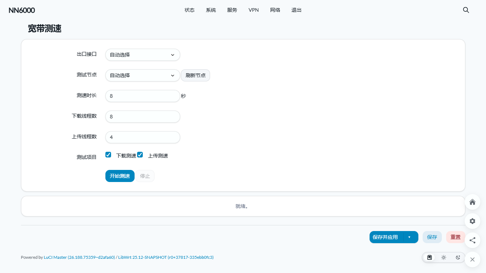

# OpenWrt测速插件，测速源来自全球网测

## 界面截图



## 作为 feed 使用

在 OpenWrt源码 中执行：

```sh
echo 'src-git cnspeedtest https://github.com/Canary233/luci-app-cnspeedtest.git' >> feeds.conf.default
./scripts/feeds update cnspeedtest
./scripts/feeds install cnspeedtest
./scripts/feeds install luci-app-cnspeedtest
make menuconfig
```

在菜单中需要选择：

- `LuCI -> Applications -> luci-app-cnspeedtest`

只编译插件包：

```sh
make package/feeds/cnspeedtest/luci-app-cnspeedtest/compile V=s
```

安装后 LuCI 入口位于：

```text
服务 -> 宽带测速
```
